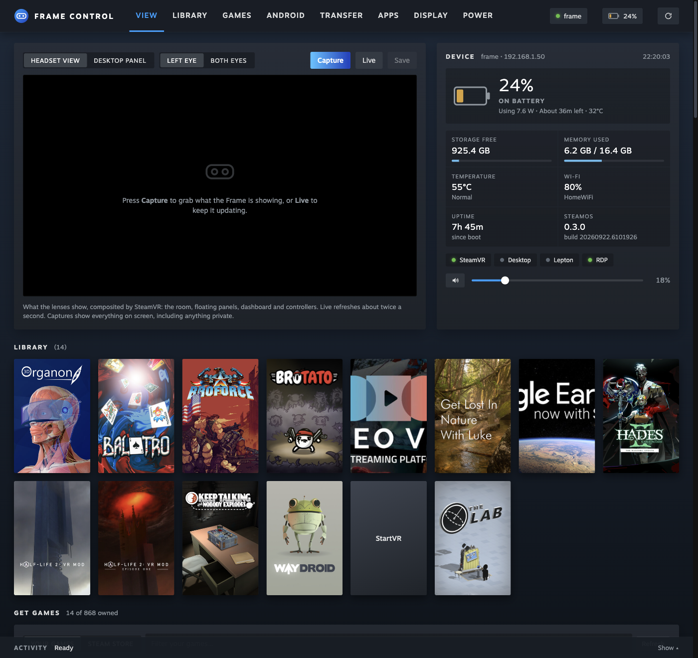

# Steam Frame ↔ Mac

This repo holds notes and Mac-side helpers for controlling a Valve Steam Frame
(standalone VR headset: SteamOS 3, Arch-based, arm64, Snapdragon 8 Gen 3) from
this Mac, with as little typing on the headset's virtual keyboard as possible.

Status: written 2026-09-25 and checked against a real Frame the same day
(SteamOS 0.3.0, variant `vr`, build 20260922). The **Frame Control** Mac app
and most scripts are **verified** on the device. The scripts table below marks
each one, and [docs/open-questions.md](docs/open-questions.md#verified-on-device-2026-09-25)
lists what's still unchecked.

**Quick start:** set up SSH once (next section), then install
[Frame Control](#frame-control-mac-app) from the DMG.

## Minimum typing on the headset

Valve's own developer docs say SSH, ADB, and RDP are all turned on through a
**UI toggle**. You don't need a terminal, `passwd`, or `systemctl`. The only
thing you type on the headset is a password you choose.

On the Frame:

1. **Steam Settings → System → Enable Developer Mode** (a toggle, no typing).
2. Scroll down to the **Developer** section and click **Set User Password**.
   Type a password. **This is the only thing you type on the headset.** Pick
   something short, because you'll type it once more on the Mac and then
   never again.
3. (Optional, no typing) Note the IP address from **Quick Settings** or
   **Steam Settings → Internet**, in case `frame.local` doesn't resolve.
4. (Optional) Check **Steam Settings → System → Hostname**. Leaving it as
   `frame` means the scripts work without any extra setup.

On the Mac:

```sh
cd ~/projects/steam-frame
./scripts/connect.sh              # or: ./scripts/connect.sh 192.168.1.50
ssh frame                          # passwordless from now on
```

`connect.sh` does four things:

- finds the headset (`frame.local`, then `frame`, or the IP/host you pass in)
- creates a dedicated key (`~/.ssh/id_ed25519_frame`)
- adds a `Host frame` block to `~/.ssh/config`
- runs `ssh-copy-id`, which asks for the Developer Mode password once

Run `./scripts/connect.sh --harden` later if you want to turn off SSH password
logins.

Sources: [Valve: Setting up your Steam Frame for development](https://partner.steamgames.com/doc/steamhardware/steamframe/setup),
[Valve: Steam Frame Debugging](https://partner.steamgames.com/doc/steamhardware/steamframe/debugging)
(both **confirmed on Steam Frame**, Valve official).

**Fallback, only if the Developer Mode toggle doesn't give you SSH.** From the
Mac, run `./scripts/serve-bootstrap.sh`. It prints a one-liner of about 30
characters, like `curl -fsS mac.local:8765|bash`, to type into Konsole on the
Frame's Linux desktop. The script it serves installs your Mac's public key and
enables `sshd`. See [docs/ssh.md](docs/ssh.md#fallback-bootstrap-one-liner).

## Recommended options

| Goal | Recommended | Confidence |
|---|---|---|
| Shell on the Frame | `ssh frame` (user `steamos`) | Confirmed (Valve docs) |
| **See/control the Frame from the Mac** | **Steam Link for macOS → connect to `frame`** (Valve names this). Alternatives: RDP to `xrdp` with Microsoft *Windows App* for the Linux desktop, or `adb`/`scrcpy` for the Android (Lepton) layer only | Steam Link and xrdp confirmed on Frame; the Mac RDP client is inferred |
| **Show the Mac's desktop inside the Frame** | **macOS Screen Sharing (built-in VNC) → Remmina (Flatpak, aarch64) on the Frame's Linux desktop**, installed over SSH | Inferred: each piece is documented, but the combination hasn't been tested on a Frame |
| File transfer | `scp` / `rsync` over the `frame` alias (`scripts/push.sh`) | **Verified** (rsync is on the image) |
| Paste Mac clipboard into the headset | `scripts/paste-to-frame.sh` (`pbpaste` → `ssh` → Klipper over D-Bus), or the clipboard sync in an RDP session | **Verified** (script); RDP untested |

Details: [docs/ssh.md](docs/ssh.md), [docs/streaming.md](docs/streaming.md),
[docs/file-transfer.md](docs/file-transfer.md),
[docs/open-questions.md](docs/open-questions.md). For how the Frame's software
fits together, see [docs/how-the-frame-works.md](docs/how-the-frame-works.md).

## Windows anywhere in the room

The in-headset Linux desktop is a single 1280×800 panel, and its windows can't
leave it. Each Steam app, though, gets its own SteamVR panel. That also works
for any Linux app tagged with an app id of its own:

```sh
./scripts/panel-on-frame.sh konsole
./scripts/panel-on-frame.sh mac-screen      # the Mac's screen, in its own panel
```

Then use the SteamVR dashboard's **Float in World**, **Move** and **Size**
controls to place each panel. See [docs/panels.md](docs/panels.md).

## Frame Control (Mac app)

As of 2026-09-25 no other Mac app manages the Frame end to end.
[Stream Frame](https://streamframe.app/) (macOS 14+, free) records and screenshots
the headset over SSH. [FrameDrop](https://framedropvr.com) sideloads but is
Windows-only. Steam Link views the headset. **Frame Control** is a Mac app over
the scripts below. Install it from the DMG (see [Mac app](#mac-app)), or run
the same UI in a browser without packaging:

```sh
./scripts/frame-ui.sh        # opens http://127.0.0.1:47810 in its own window
```



- **Headset view**: what the lenses show, as SteamVR composites it (the room,
  floating panels, dashboard and controllers). Shows the left eye, like pointing
  a camera into one lens, or both eyes, as a single shot; saves as PNG. **Live**
  is 720p video at about 30 fps: `ffmpeg` on the Frame encodes SteamVR's
  headset-view device (`/dev/video99`) to H.264 over SSH, and the page decodes
  it with WebCodecs. Live video is one eye; Capture still gets both. The viewer fits the whole frame; zoom with − / + (or scroll, or
  double-click), drag to pan, `0` to fit, `F` for full screen. Capture uses OpenVR's `IVRScreenshots` API through Python `ctypes`
  (`ui/frame_vrshot.py`). Nothing extra is installed on the Frame (SteamOS ships `ffmpeg`). **Desktop panel**
  captures gamescope's flat layer instead.
- Battery with charging state: charge rate in watts, time to full or empty,
  charger type and wattage (for example USB-C PD 20 W), and battery temperature
- Storage, memory, temperature, Wi-Fi, uptime, and whether SteamVR, the desktop,
  Lepton and xrdp are running
- Library shelf with Steam cover art and a Play button (`steam://rungameid`)
- **Get games**: every game you own with its Steam Frame rating (Verified,
  Playable, Unsupported, Unknown). Install on Frame downloads it to the headset
  with live progress. Search the Steam store with prices and Frame ratings; Buy
  opens the store page in your browser, or Store on Frame opens it in the
  headset. It drives the Frame's own Steam client through its DevTools port;
  see `docs/steam-games.md`
- Volume and mute (`wpctl`)
- **Android apps**: search about 4,500 F-Droid apps rated for the Frame, install
  one with a click as its own Lepton instance (it keeps its data and shows in the
  Steam library), then launch, stop, test or remove it. **Report an APK** records whether any APK
  worked (F-Droid or not: pick a file, type a package, or use an installed app). The
  ratings go into our private compatibility database (a Lakebed capsule only the
  app can use, backed up daily to Google Drive; see `compat-db/README.md`)
- **Android display**: pick a running Lepton instance (by the app in it) and set
  its resolution (Native 1920×1080, or Sharp 2560×1440 with density scaled to
  match), UI scale (Smaller / Default / Larger, or an exact dpi) and text size
  (0.85–1.3×) over ADB (`wm size`, `wm density`, `font_scale`). Reset puts all three
  back. Whether the settings survive the app relaunching is untested
- Drag and drop files to `~/Downloads`; `.apk` files install as their own Android app
- Send typed text, or the Mac clipboard, to the Frame clipboard
- Install and remove Flatpaks (quick picks: Moonlight, Firefox, VLC, Remmina)
- One-click SSH or SFTP in Terminal, Steam Link, and Windows App (RDP).
  Sleep, restart and shut down open Terminal because SteamOS asks for the
  sudo password over SSH.

The server is Python stdlib only and listens on 127.0.0.1. It rejects requests
with a non-local `Host` header, and any `/api/` request without a custom
header, so other websites can't drive it or read captures. It keeps a single multiplexed SSH connection open, so
status and each capture take about 0.3s. Headset captures are deleted from the
Frame as soon as they're copied, because they show everything on screen,
including anything private. The look follows the Steam client: its palette,
Motiva Sans (loaded from Valve's CDN), portrait library capsules and green
Play buttons. **Verified on the Frame 2026-09-25:** status and charging details,
both capture modes (headset view while in use, and a blank frame in standby,
which the UI labels), clipboard, volume, file push, and input validation. **Not yet exercised from the UI:** Launch, Flatpak
install/remove, APK drop, and the power buttons. Each of these calls a
command or script that was verified separately.

### Mac app

`app/` wraps the same UI as a standalone Mac app (Electron). The app bundles
`ui/`, `scripts/`, `frame/android/` and the rated catalogue from `apk-catalog/`.
It starts `ui/server.py` on a free loopback port and shows it in its own window.
The server stops when you quit the app. A prebuilt DMG for Apple Silicon is
attached to each [GitHub release](https://github.com/saphid/steam-frame/releases).

```sh
cd app
npm install
npm run dist     # → app/dist/Frame Control-<version>-arm64.dmg (and a .zip)
npm start        # run from the checkout without packaging
```

Open the DMG and drag **Frame Control** to Applications. You need `python3` on
the Mac (Xcode Command Line Tools or Homebrew). The app reads `PATH` from your
login shell, so Homebrew's `rsync` and `adb` work when you launch it from
Finder. Each time it starts while there's no `frame` SSH alias, the app offers
to run `connect.sh` in Terminal. **Frame → Set Up Connection…** does the same
at any time. The Frame menu also shows the server log at
`~/Library/Logs/Frame Control/server.log`. Installing APKs needs `adb`
(`brew install android-platform-tools`). The Android ratings database needs
its key in the Keychain (see `compat-db/README.md`); without it, the app uses
its offline copy.

The build is ad-hoc signed and not notarized. A copy you build yourself opens
normally. A copy downloaded from GitHub Releases is quarantined; clear it with
`xattr -dr com.apple.quarantine "/Applications/Frame Control.app"`. The first
time you use them, macOS asks to allow local network access (for SSH) and
control of Terminal (for SSH and power actions). **Verified 2026-09-25:**
installed from the DMG, launched from Finder, connected to the Frame, and
showed live status and the library.

## Scripts

| Script | Runs on | Purpose |
|---|---|---|
| `scripts/tailscale-on-frame.sh` | Mac → Frame | Install Tailscale in `~` as a userspace user service so `frame` works from anywhere; `--uninstall` (**verified** on the LAN) |
| `scripts/connect.sh` | Mac | Discover, set up key and `~/.ssh/config`, copy key, optional `--harden` (**verified**; `--harden` untested) |
| `scripts/install-apps.sh` | Mac → Frame | Install Flatpaks (Remmina, Moonlight, …) on the Frame over SSH as `--user` (**verified** with Remmina) |
| `scripts/paste-to-frame.sh` | Mac → Frame | Send the Mac clipboard (or stdin) to the Frame clipboard (**verified**) |
| `scripts/install-apk.sh` | Mac → Frame | Install APKs, each as its own persistent Lepton instance with a Steam library shortcut (`--dev`: old ADB path into Lepton Development) (**verified**; see [docs/apks.md](docs/apks.md)) |
| `scripts/panel-on-frame.sh` | Mac → Frame | Start an app as its own floating VR panel, outside the desktop (**verified**: overlays created; in-headset placement not yet checked) |
| `scripts/run-on-frame.sh` | Mac → Frame | Start an app on the headset desktop, e.g. `mac-screen` opens Remmina straight into the Mac (**verified**) |
| `scripts/frame-ui.sh` | Mac | Start the Frame Control web UI (`ui/server.py`) and open it (**verified**) |
| `scripts/apk-catalog.sh` | Mac | Refresh the rated F-Droid catalogue that Frame Control's Android section shows (**verified**) |
| `scripts/compat-db-backup.sh` | Mac | Back up the compatibility database locally and to Google Drive (daily LaunchAgent) (**verified**) |
| `scripts/push-vr-video.sh` | Mac → Frame | Upload VR180/360 videos to `~/Videos/VR`, linked into DeoVR's Proton prefix; `--launch` starts DeoVR (**verified**: upload and link; in-headset playback of local files not yet checked). See [docs/vr-video.md](docs/vr-video.md) |
| `scripts/push.sh` | Mac → Frame | `rsync` files to `~/Downloads` (or a given path) on the Frame (**verified**) |
| `scripts/serve-bootstrap.sh` | Mac | Fallback: serve `bootstrap-on-frame.sh` with your public key embedded |
| `scripts/bootstrap-on-frame.sh` | Frame | Fallback: install the key and enable `sshd` |

## Security notes

- With Developer Mode on, `sshd`, ADB and xrdp are all reachable on your LAN.
  Each running Lepton (Android) instance opens its own ADB port in 5555–5599,
  listening on `0.0.0.0` rather than only loopback. This was seen on the
  device on 2026-09-25, so anyone on the network can reach it. Use trusted
  networks only, and turn Developer Mode off when you don't need it.
- Frame Control reaches ADB and the Steam client's DevTools port (Frame
  loopback `127.0.0.1:8080`) only through SSH tunnels. The compatibility
  database key lives in the macOS Keychain and is never written to the repo.
- `steamos` has `sudo`, protected by the same Developer Mode password. Once
  you've switched to key auth, a short password still protects `sudo` and
  RDP, so pick one that isn't trivially guessable.
- Don't port-forward 22, 3389, or 5555–5599 from your router. For remote access,
  use Tailscale: `scripts/tailscale-on-frame.sh` (no sudo). In its userspace mode
  **every** Frame port is reachable from your tailnet, including Steam's DevTools
  on loopback 8080; see [docs/tailscale.md](docs/tailscale.md).

## Development

```sh
python3 -m unittest discover -s tests   # server guards, validation, Steam helpers; no headset needed
cd app && npm install && npm run dist   # build the DMG
```

GitHub Actions runs the tests on Python 3.9, which is the oldest `python3` the app
may find (Xcode Command Line Tools), plus syntax checks for every script and the
Electron main process (`.github/workflows/checks.yml`). Anything that touches the
headset is verified by hand against a real Frame, and the docs label it
**verified** or **inferred**.
