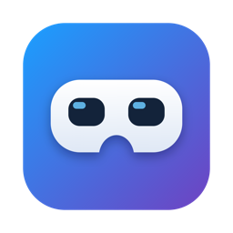

<div align="center">



# Frame Control

**Manage your Valve Steam Frame from your computer.**<br>
See what the headset sees, install games and Android apps, move files and text across, and check battery and status, all over SSH.

[](https://github.com/saphid/steam-frame/releases/latest)
[](#install)
[](https://github.com/saphid/steam-frame/actions/workflows/checks.yml)
[](LICENSE)

[**Download**](#install) · [Features](#features) · [Set up the headset](#set-up-the-headset) · [Feedback](#feedback) · [Docs](#going-further)

<br>


<sub>Unofficial hobby project, not affiliated with Valve. Free and open source.</sub>

</div>

---

## Features

<table>
<tr>
<td width="50%" valign="top">

**👓 Headset view**<br>
Live video of what the lenses show (about 30 fps), or a still of both eyes. Zoom, pan, full screen, save as PNG.

</td>
<td width="50%" valign="top">

**🔋 Battery and status**<br>
Charge, charging watts and time left, storage, memory, temperature, Wi-Fi, and what's running.

</td>
</tr>
<tr>
<td valign="top">

**🎮 Steam games**<br>
Everything you own with its Steam Frame rating. Install onto the headset with live progress, and search the store.

</td>
<td valign="top">

**🤖 Android apps**<br>
About 4,500 F-Droid apps rated for the Frame. One click installs each as its own app in your Steam library.

</td>
</tr>
<tr>
<td valign="top">

**📁 Files and clipboard**<br>
Drag files onto the window to send them. Send text or your clipboard straight to the headset's desktop.

</td>
<td valign="top">

**📸 Screenshots**<br>
Browse the shots you take in the headset and save them to your Pictures folder.

</td>
</tr>
<tr>
<td valign="top">

**🧩 Flatpaks and display**<br>
Install desktop apps like Moonlight or VLC, and set each Android app's resolution and text size.

</td>
<td valign="top">

**⚡ One-click tools**<br>
SSH, SFTP, Steam Link, remote desktop, volume, sleep, restart and shut down.

</td>
</tr>
</table>

Nothing is installed on the Frame for any of this: the app uses what SteamOS
already ships. [How each feature works](docs/frame-control.md).

## Install

| | Download | Needs |
|---|---|---|
| **macOS** (Apple Silicon) | [Frame-Control-mac-arm64.dmg](https://github.com/saphid/steam-frame/releases/latest/download/Frame-Control-mac-arm64.dmg) | Nothing extra |
| **Windows** 10 / 11 (x64) | [Frame-Control-Setup-x64.exe](https://github.com/saphid/steam-frame/releases/latest/download/Frame-Control-Setup-x64.exe) · [portable .zip](https://github.com/saphid/steam-frame/releases/latest/download/Frame-Control-win-x64.zip) | Nothing extra |
| **Linux** (x64) | [AppImage](https://github.com/saphid/steam-frame/releases/latest/download/Frame-Control-linux-x86_64.AppImage) · [.deb](https://github.com/saphid/steam-frame/releases/latest/download/Frame-Control-linux-amd64.deb) | `ssh` (most desktops have it) |
| **Linux** (arm64) | [AppImage](https://github.com/saphid/steam-frame/releases/latest/download/Frame-Control-linux-arm64.AppImage) · [.deb](https://github.com/saphid/steam-frame/releases/latest/download/Frame-Control-linux-arm64.deb) | `ssh`, and `adb` for Android apps (`sudo apt install adb`) |

The app brings its own Python and `adb`; SSH is built into macOS and Windows.
Google doesn't publish `adb` for arm64 Linux, so that build uses your
distribution's. If you already have `adb`, the app uses yours.

<details>
<summary><b>macOS: the app isn't notarized</b></summary>

There's no paid Apple developer account behind it, so macOS says the app is
damaged or can't be checked. Drag it to Applications, then clear the download
quarantine once:

```sh
xattr -dr com.apple.quarantine "/Applications/Frame Control.app"
```

The first time, macOS also asks to allow local network access (for SSH) and
control of Terminal (for the password prompts).
</details>

<details>
<summary><b>Windows: SmartScreen warning</b></summary>

The installer isn't code-signed, so Windows SmartScreen may say it protected
your PC. Choose **More info → Run anyway**. The portable `.zip` avoids the
installer: unzip it anywhere and run `Frame Control.exe`.
</details>

<details>
<summary><b>Linux: running the AppImage</b></summary>

```sh
chmod +x Frame-Control-linux-*.AppImage && ./Frame-Control-linux-*.AppImage
```

If it complains about FUSE, install `libfuse2` (Ubuntu 24.04+: `libfuse2t64`),
or run it with `--appimage-extract-and-run`.
</details>

## Set up the headset

You type one password on the headset, once. Everything else happens on your
computer.

1. **On the Frame:** Steam Settings → System → **Enable Developer Mode**, then
   in the Developer section, **Set User Password**. Pick something short:
   you'll type it once more on your computer and then never again.
2. **On your computer:** open Frame Control. It offers to **Set Up
   Connection**, which finds the headset, creates an SSH key, and asks for that
   password once in a terminal window. If it can't find the Frame, type the
   IP address from the Frame's Quick Settings.
3. That's it. The app now reaches the headset whenever it's awake and on the
   same network. For anywhere else, see [Tailscale](docs/tailscale.md).

**What it changes:** only what you click. Installs go to your user account on
the Frame (`--user` Flatpaks, Lepton instances, Steam downloads), and nothing
needs `sudo` except the power buttons. On your computer it adds a `Host frame`
entry to `~/.ssh/config` and a key at `~/.ssh/id_ed25519_frame`.

## Feedback

This is a first public test, so reports are really useful, especially from
Windows and Linux. Please [open an issue](https://github.com/saphid/steam-frame/issues/new)
with:

- what you tried and what happened
- your computer's OS and your SteamOS build (Steam Settings → System)
- the server log: **Frame → Show Server Log** in the app

## Going further

This repo also holds the scripts behind the app and field notes on how the
Frame's software fits together, all checked against a real headset and labelled
**verified** or **inferred**.

| | |
|---|---|
| [Frame Control in detail](docs/frame-control.md) | Every feature, how it works, per-platform notes, building |
| [Scripts and headset setup](docs/scripts.md) | The command-line helpers, minimum typing, streaming options, floating panels |
| [How the Frame works](docs/how-the-frame-works.md) | SteamVR → gamescope → Plasma, verified facts, debugging |
| [Android apps (Lepton)](docs/apks.md) | Sideloading, the rated F-Droid catalogue, per-app instances |
| [Steam games](docs/steam-games.md) · [VR video](docs/vr-video.md) · [WebXR in Chromium](docs/webxr-chromium.md) | Installing and buying, watching VR180/360, the Chromium build |
| [SSH](docs/ssh.md) · [Streaming](docs/streaming.md) · [Files](docs/file-transfer.md) · [Panels](docs/panels.md) · [Tailscale](docs/tailscale.md) | Topic notes |
| [Open questions](docs/open-questions.md) | What's still unchecked |

<details>
<summary><b>Security notes</b></summary>

- With Developer Mode on, `sshd`, ADB and xrdp are all reachable on your LAN.
  Each running Lepton (Android) instance opens its own ADB port in 5555–5599,
  listening on `0.0.0.0` rather than only loopback. This was seen on the
  device on 2026-09-25, so anyone on the network can reach it. Use trusted
  networks only, and turn Developer Mode off when you don't need it.
- Frame Control reaches ADB and the Steam client's DevTools port (Frame
  loopback `127.0.0.1:8080`) only through SSH tunnels. The compatibility
  database key (maintainer-only) is never written to the repo.
- `steamos` has `sudo`, protected by the same Developer Mode password. Once
  you've switched to key auth, a short password still protects `sudo` and
  RDP, so pick one that isn't trivially guessable.
- Don't port-forward 22, 3389, or 5555–5599 from your router. For remote access,
  use Tailscale: `scripts/tailscale-on-frame.sh` (no sudo). In its userspace mode
  **every** Frame port is reachable from your tailnet, including Steam's DevTools
  on loopback 8080; see [docs/tailscale.md](docs/tailscale.md).
</details>

## Development

```sh
python3 -m unittest discover -s tests   # server tests; no headset needed
cd app && npm install && npm start      # run the app from the checkout
```

The server is Python stdlib only; the app is Electron. GitHub Actions runs the
tests on macOS, Windows and Linux, and a `v*` tag builds all three installers
into the release. See [building](docs/frame-control.md#building).

## License

[MIT](LICENSE). Steam, Steam Frame and SteamVR are trademarks of Valve
Corporation. This project isn't affiliated with or endorsed by Valve.
